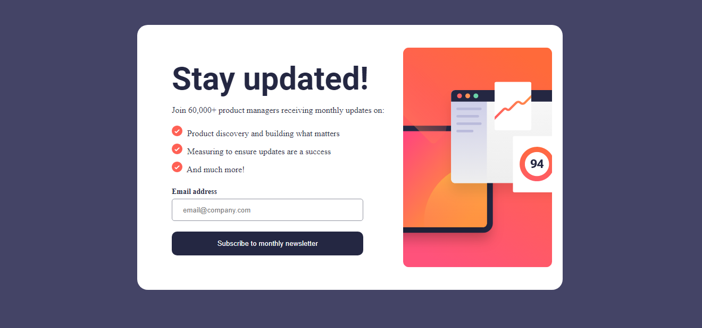
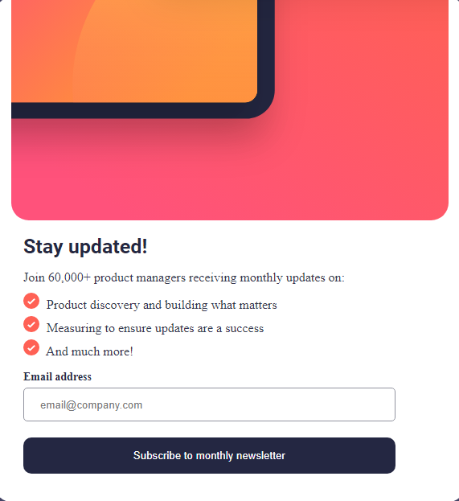

# Frontend Mentor - Newsletter sign-up form with success message solution

This is a solution to the [Newsletter sign-up form with success message challenge on Frontend Mentor](https://www.frontendmentor.io/challenges/newsletter-signup-form-with-success-message-3FC1AZbNrv). Frontend Mentor challenges help you improve your coding skills by building realistic projects. 

## Table of contents

- [Overview](#overview)
  - [The challenge](#the-challenge)
  - [Screenshot](#screenshot)
  - [Links](#links)
- [My process](#my-process)
  - [Built with](#built-with)
  - [What I learned](#what-i-learned)
  - [Continued development](#continued-development)
  - [Useful resources](#useful-resources)
- [Author](#author)
- [Acknowledgments](#acknowledgments)

## Overview

### The challenge

Users should be able to:

- Add their email and submit the form
- See a success message with their email after successfully submitting the form
- See form validation messages if:
  - The field is left empty
  - The email address is not formatted correctly
- View the optimal layout for the interface depending on their device's screen size
- See hover and focus states for all interactive elements on the page

### Screenshots

### Links

- Solution URL: [Solution in netlify](https://prismatic-melomakarona-26b41c.netlify.app)

## My process

### Built with

- Semantic HTML5 markup
- CSS custom properties
- Flexbox
- Media Querys
- Javascript vanilla

### What I learned

I learned how to use flexbox for styling layouts and how to create gradients as well, this was for the button styling.

I also learned more about regular expressions when I was validating the email from the user input, I did a little research in [stack overflow](https://stackoverflow.com) 💡.

I had so much fun learning new things and putting in practice the knowledge from html, css and js that I got so far! 😄

### Continued development

I'd like to learn more about design and styling web pages because that's not my best. I prefer working with back end but I know that front end is also important and since I like it I want to improve my skills.

I've heard that front end mentor is the perfect place to do that so here I am! I hope I can make it through more challenges.

### Useful resources

- [How to validate email with javascript](https://stackoverflow.com/questions/46155/how-can-i-validate-an-email-address-in-javascript) - This helped me to comprehend more about regular expresions using javascript I hope it can be of help for others.

## Author

- Github - [IsaacLezama](https://github.com/IsaacLezama)
- Frontend Mentor - [@IsaacLezama](https://www.frontendmentor.io/profile/IsaacLezama)

